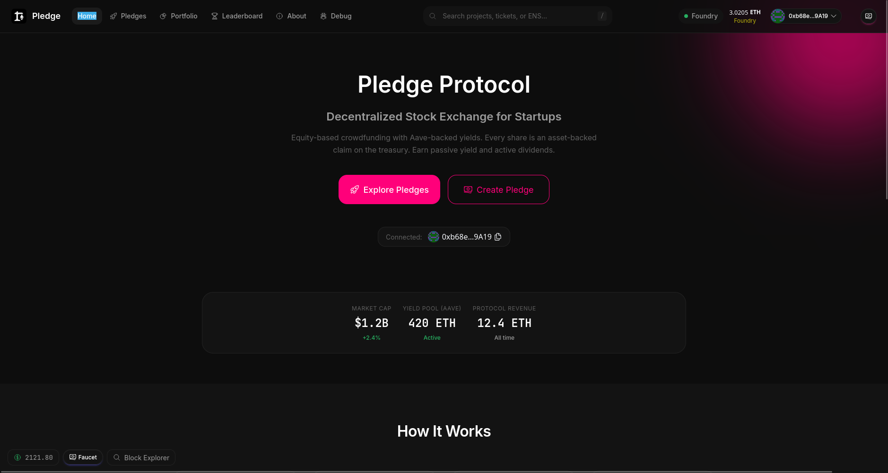
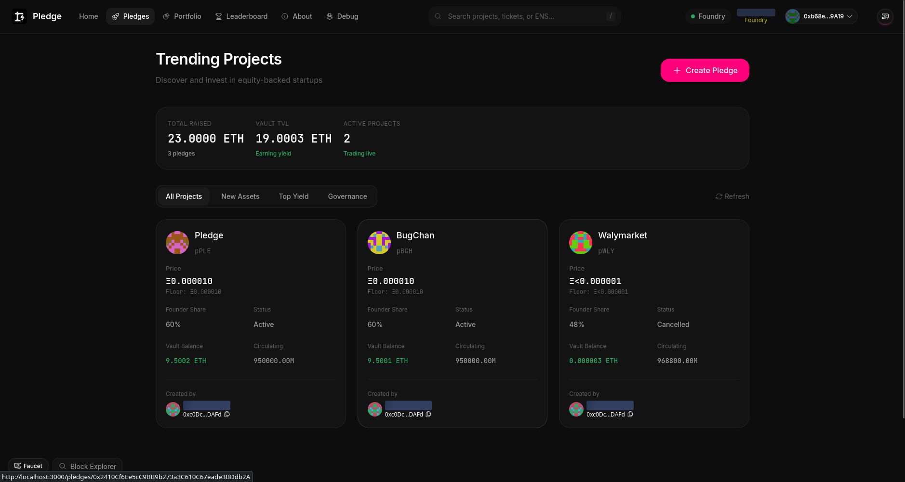
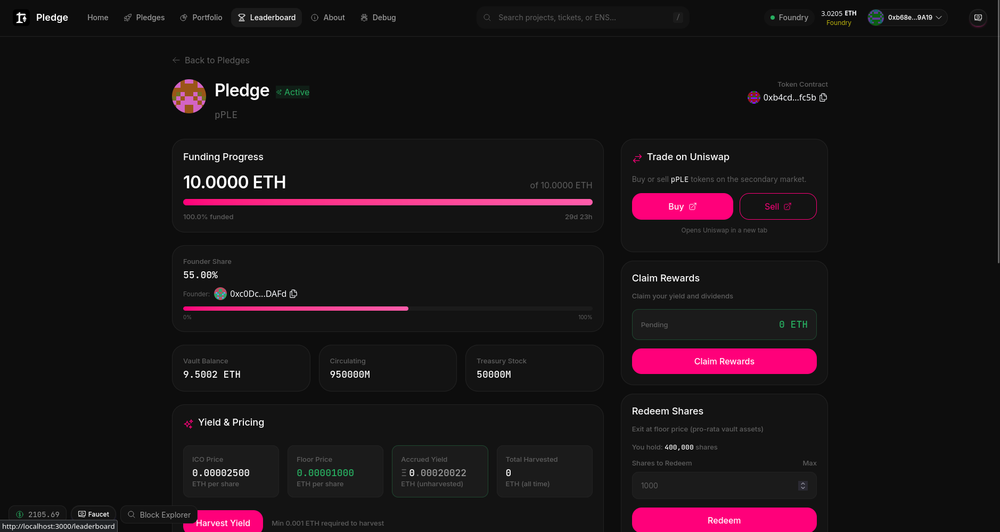

# 🚀 Pledge Protocol

<h4 align="center">
  <a href="https://pledge-crowd.vercel.app">Website</a>
</h4>

A decentralized stock exchange for startups. Pledge Protocol enables founders to raise funds through tokenized equity vaults, giving contributors ownership shares in early-stage projects.

## Screenshots

<p align="center">
  
</p>

<p align="center">
  
</p>

<p align="center">
  
</p>

## How It Works

1. **Create** - Founders launch a pledge with funding goals and equity terms
2. **Fund** - Contributors receive shares based on their contribution during the ICO phase
3. **Trade** - After funding completes, shares become tradeable on the open market
4. **Earn** - Founders and contributors benefit from project success

## Features

- 🏦 **Tokenized Equity Vaults** - ERC20 tokens representing startup shares
- 🔒 **Minimal Proxies** - EIP-1167 clones for gas-efficient, battle-tested deployments
- 📊 **Transparent Funding** - On-chain tracking of contributions and ownership
- 💱 **Secondary Trading** - Trade shares after funding completes
- ⚡ **Uniswap v4 Integration** - Liquidity and trading infrastructure

## Tech Stack

- **Smart Contracts**: Solidity with Foundry
- **Frontend**: Next.js (App Router), TypeScript, Tailwind CSS, DaisyUI
- **Web3**: RainbowKit, Wagmi, Viem
- **AMM**: Uniswap v4 Core

## Requirements

Before you begin, you need to install the following tools:

- [Node (>= v20.18.3)](https://nodejs.org/en/download/)
- Yarn ([v1](https://classic.yarnpkg.com/en/docs/install/) or [v2+](https://yarnpkg.com/getting-started/install))
- [Git](https://git-scm.com/downloads)
- [Foundry](https://book.getfoundry.sh/getting-started/installation)

## Quickstart

1. Install dependencies:

```bash
yarn install
```

2. Start the local blockchain:

```bash
yarn fork baseSepolia
```

3. Deploy contracts (in a new terminal):

```bash
yarn deploy
```

4. Start the frontend (in a new terminal):

```bash
yarn start
```

Visit your app at `http://localhost:3000`.

## Development

```bash
# Run smart contract tests
yarn foundry:test

# Lint code
yarn lint

# Format code
yarn format

# Build frontend
yarn next:build
```

## Project Structure

- `packages/foundry/contracts/` - Smart contracts
- `packages/foundry/script/` - Deployment scripts
- `packages/foundry/test/` - Contract tests
- `packages/nextjs/` - Frontend application
- `packages/nextjs/app/` - Next.js pages (App Router)
- `packages/nextjs/components/` - React components
- `packages/nextjs/hooks/` - Custom React hooks

## Deployment

```bash
# Deploy to testnet/mainnet
yarn deploy --network <network>

# Verify contracts
yarn verify --network <network>

# Deploy frontend
yarn vercel:yolo --prod
```

## Documentation

Visit [Scaffold-ETH 2 docs](https://docs.scaffoldeth.io) for framework documentation.

## Contributing

See [CONTRIBUTING.md](CONTRIBUTING.md) for contribution guidelines.

## License

MIT License - see [LICENCE](LICENCE)
